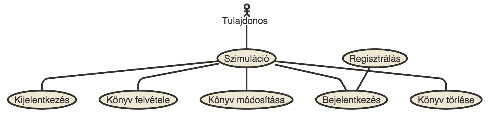
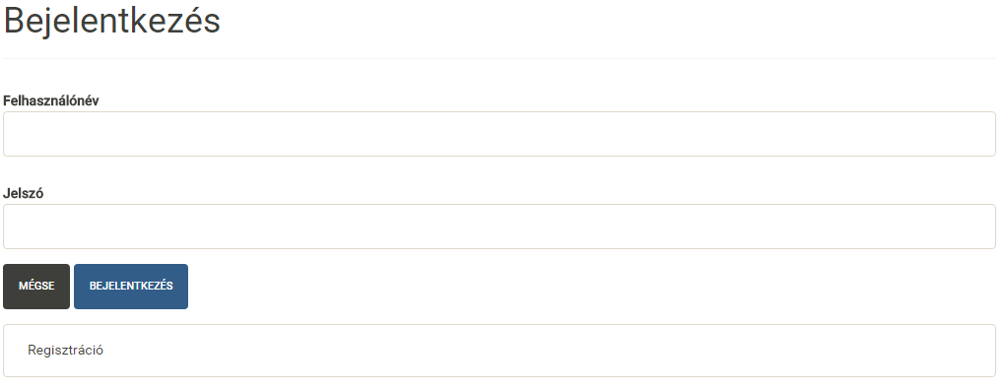
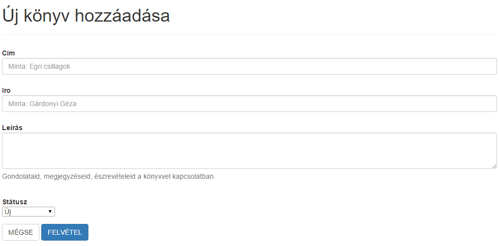
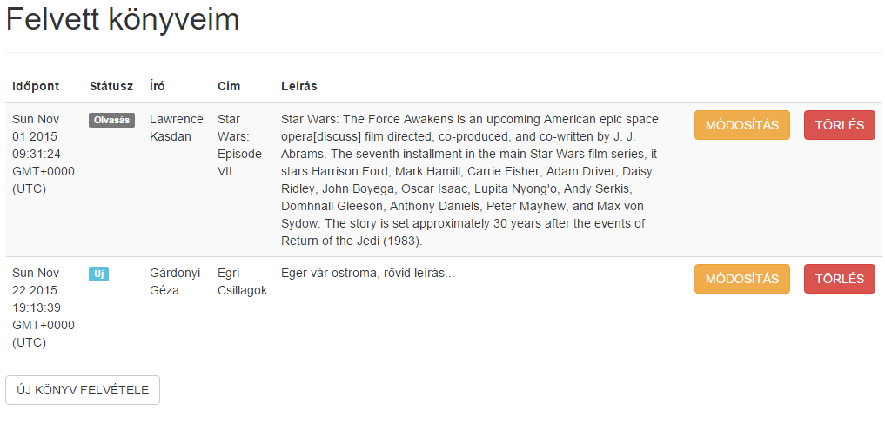
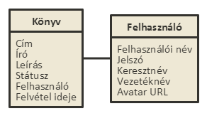
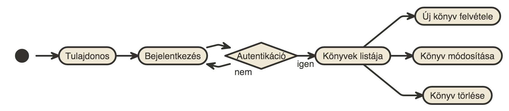

# Dokumentáció - Könyv nyilvántartó
Név: Kévés Bence Mihály
NEPTUN: G15V0Q
E-mail: kebtaai@inf.xxxxx.hu

## Követelményanalízis
1. Követelmények:
    * Funkcionális követelmények:
        - Regisztráció engedélyezése az oldalra
        - A regisztárciót követően lehessen be-, illetve kijelentkezésre az oldalról
        - Az elsó belépésnél egy üres lista jelenjen meg a felhasználónak, ehhez lehessen felvenni tetszőleges új elemet
        - A felvett elemeket lehessen törölni, módosítani
        - Az új elem hozzáadását követően a felhasználónak jelenjen meg a felvett elem, lista formájában
        
    * Nem funkcionális követelmények: 
        - Letisztult és egyszerű felhasználó felület
        - Csak regisztrált felhasználó tudja használni az oldalt, regisztrációhoz kötött
        - A látogatóknak nincs joga megtekinteni a listát, nem tud belépni
        - Bejelentkezés után válik láthatóvá a tartalom
        
2. Szakterületi fogalomjegyzék:
    * A könyv: olyan objektum, melynek, címe, írója, hozzá fűzött megjegyzés, illetve státusza/állapota lehet
    * A státusz/állapot: lehet egy könyv: új, olvasás alatt álló (olvasás), elolvasva (kész), kölcsön adva, illetve kidobásra vár
    * A lista: könyvek gyűjteménye
    * A módosítás: a könyv tulajdonságainak megváltoztatása
    * A törlés: könyv törlése a gyűjteményből (listából)

3. Használatieset-modell

Használati eset diagramm

####

* [Diagram terve](http://www.nomnoml.com/#view/%5B%3Cactor%3ETulajdonos%5D%20-%20%5B%3Cusecase%3E%20Szimul%C3%A1ci%C3%B3%5D%0A%5B%3Cusecase%3ERegisztr%C3%A1l%C3%A1s%5D%20-%20%5B%3Cusecase%3E%20Bejelentkez%C3%A9s%5D%0A%5BSzimul%C3%A1ci%C3%B3%5D%20-%20%5B%3Cusecase%3E%20Bejelentkez%C3%A9s%5D%0A%5BSzimul%C3%A1ci%C3%B3%5D%20-%20%5B%3Cusecase%3E%20Kijelentkez%C3%A9s%5D%0A%5BSzimul%C3%A1ci%C3%B3%5D%20-%20%5B%3Cusecase%3E%20K%C3%B6nyv%20felv%C3%A9tele%5D%0A%5BSzimul%C3%A1ci%C3%B3%5D%20-%20%5B%3Cusecase%3E%20K%C3%B6nyv%20m%C3%B3dos%C3%ADt%C3%A1sa%5D%0A%5BSzimul%C3%A1ci%C3%B3%5D%20-%20%5B%3Cusecase%3E%20K%C3%B6nyv%20t%C3%B6rl%C3%A9se%5D%0A%0A%0A%0A%0A%0A)

Új könyv felvétele a listába

* [Diagram terve](http://www.nomnoml.com/#view/%23direction%3A%20right%0A%5B%3Cstart%3E%20start%5D-%3E%5B%3Cstate%3ETulajdonos%5D%0A%5BTulajdonos%5D-%3E%5B%3Cstate%3EBejelentkez%C3%A9s%5D%0A%5BBejelentkez%C3%A9s%5D-%3E%5B%3Cchoice%3E%20Autentik%C3%A1ci%C3%B3%5D%0A%5BAutentik%C3%A1ci%C3%B3%5Dnem-%3E%5BBejelentkez%C3%A9s%5D%0A%5BAutentik%C3%A1ci%C3%B3%5Digen-%3E%5B%3Cstate%3EK%C3%B6nyvek%20list%C3%A1ja%5D%0A%5BK%C3%B6nyvek%20list%C3%A1ja%5D-%3E%5B%3Cstate%3E%20%C3%9Aj%20k%C3%B6nyv%20felv%C3%A9tel%5D%0A%5B%C3%9Aj%20k%C3%B6nyv%20felv%C3%A9tel%5D-%3E%5B%3Cend%3E%20end%5D%0A)

## Tervezés
1. Architektúra terv
   * Oldaltérkép: 
         - Bejelentkezés
            + Regisztráció
         - Lista oldal
            + Új könyv felvétele
            + Könyv módosítása
            + Könyv törlése

2. Felhasználóifelület-modell
 

#### 

* [Diagram terve](http://www.nomnoml.com/#view/%23direction%3A%20right%0A%5BN%C3%A9vjegyek%20nyilv%C3%A1ntart%C3%A1sa%20%7C%20felhaszn%C3%A1l%C3%B3%3B%20n%C3%A9v%3B%20c%C3%A9g%3B%20telefonsz%C3%A1m%3B%20e-mail%5D%20-%3E%201..*%20%5B%C3%9Aj%20n%C3%A9vjegy%20%7C%20felhaszn%C3%A1l%C3%B3%3B%20n%C3%A9v%3B%20c%C3%A9g%3B%20telefonsz%C3%A1m%3B%20e-mail%5D%0A%5B%C3%9Aj%20n%C3%A9vjegy%5D-%5Bdefault.db%20%7C%20name%3B%20company%3B%20phonenumber%3B%20email%20%5D%0A)

3. Osztálymodell 

####

* [Diagram terve](http://www.nomnoml.com/#view/%23direction%3A%20right%0A%5BK%C3%B6nyv%20%7C%20C%C3%ADm%3B%20%C3%8Dr%C3%B3%3B%20Le%C3%ADr%C3%A1s%3B%20St%C3%A1tusz%3B%20Felhaszn%C3%A1l%C3%B3%3B%20Felv%C3%A9tel%20ideje%5D%20-%20%5BFelhaszn%C3%A1l%C3%B3%20%7C%20Felhaszn%C3%A1l%C3%B3i%20n%C3%A9v%3B%20Jelsz%C3%B3%3B%20Keresztn%C3%A9v%3B%20Vezet%C3%A9kn%C3%A9v%3B%20Avatar%20URL%5D%0A)

4. Dinamikus működés
   - Szekvenciadiagram:
 

* [Diagram terve](http://www.nomnoml.com/#view/%23direction%3A%20right%0A%5B%3Cstart%3E%20start%5D-%3E%5B%3Cstate%3ETulajdonos%5D%0A%5BTulajdonos%5D-%3E%5B%3Cstate%3E%20Bejelentkez%C3%A9s%5D%0A%5BBejelentkez%C3%A9s%5D-%3E%5B%3Cchoice%3E%20Autentik%C3%A1ci%C3%B3%5D%0A%5BAutentik%C3%A1ci%C3%B3%5Dnem-%3E%5BBejelentkez%C3%A9s%5D%0A%5BAutentik%C3%A1ci%C3%B3%5Digen-%3E%5B%3Cstate%3EK%C3%B6nyvek%20list%C3%A1ja%5D%0A%5BK%C3%B6nyvek%20list%C3%A1ja%5D-%3E%5B%3Cstate%3E%20%C3%9Aj%20k%C3%B6nyv%20felv%C3%A9tele%5D%0A%5BK%C3%B6nyvek%20list%C3%A1ja%5D-%3E%5B%3Cstate%3E%20K%C3%B6nyv%20m%C3%B3dos%C3%ADt%C3%A1sa%5D%0A%5BK%C3%B6nyvek%20list%C3%A1ja%5D-%3E%5B%3Cstate%3E%20K%C3%B6nyv%20t%C3%B6rl%C3%A9se%5D%0A)

## Implementáció
1. Fejlesztői környezet bemutatása: Cloud 9
   Ez a környezet mindamellett, hogy fejlesztőkörnyezet is egyben, felhőszolgáltatást nyújt, mellyel a virtuális gépen tudjuk futtatni, tárolni, fejleszteni a projektjeinket. Mások munkáját segítve megtudjuk nézni a kódjukat, illetve szükség esetén szerkeszteni is tudjuk azt, ha a másik fél erre engedélyt ad. Nagy előnye, hogy verziókövető rendszerekkel is össze tudjuk kapcsolni. 

2. Könyvtárstruktúrában lévő mappák funkiójának bemutatása:
   A könyvtárstuktúra az MVC (Model, View, Controller) modell alapján készült el. A **views** könyvtárban lévő állományok felelnek az alkalmazás megjelenéséért. A **models** könyvtárban azok az állományok találhatóak, melyek az objektumok felépítéséről hivatottak gondoskodni. A **controllers** könyvtár állományai pedig az alkalmazás működéséért felellősek, a további könyvtárak pedig a működés elősegítésére szolgálnak.
   

## Felhasználói dokumentáció
1. A futtatáshoz ajánlott hardver-, szoftver konfiguráció:
   * A program futtatásához bármely web böngésző használható.

2. A program használata
    * Böngészőben a megnyitást követően a felhasználónak lehetősége van bejelentkezni, vagy ha még nem rendelkezik felhasználói fiókkal, akkor regisztrálhat egyet. A bejelentkezés mindig felhasználói névvel és jelszó párossal történik. Regisztrációkor mindig meg kell adni egy felhasználói nevet, jelszót, kereszt- és vezetéknevet kötelezően. A bejelentkezést, vagy regisztrációt követve a felhasználó egy listát lát a képernyőn, abban az esetben, ha most regisztrált, akkor egy üres listát fog látni. Ezen a menüponton a felhasználó új elemet adhat a listához, vagy egyszerűen ki is jelentkezhet. A korábban felvett elemeket lehet a listából törölni, vagy módosítani. Az új elem hozzáadásnál a könyv címét, szerzőjét és egy rövid leírást is meg lehet adni, a felvétel időpontja automatikus lesz, ezt a rendszer fűzi mindig hozzá. 
